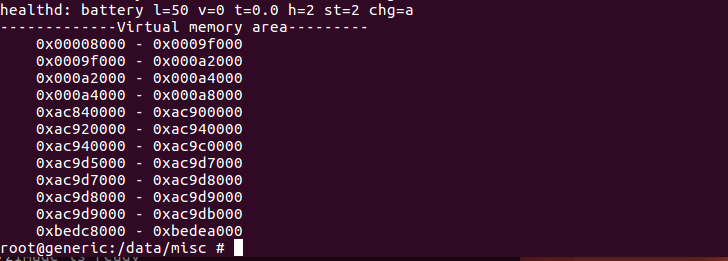
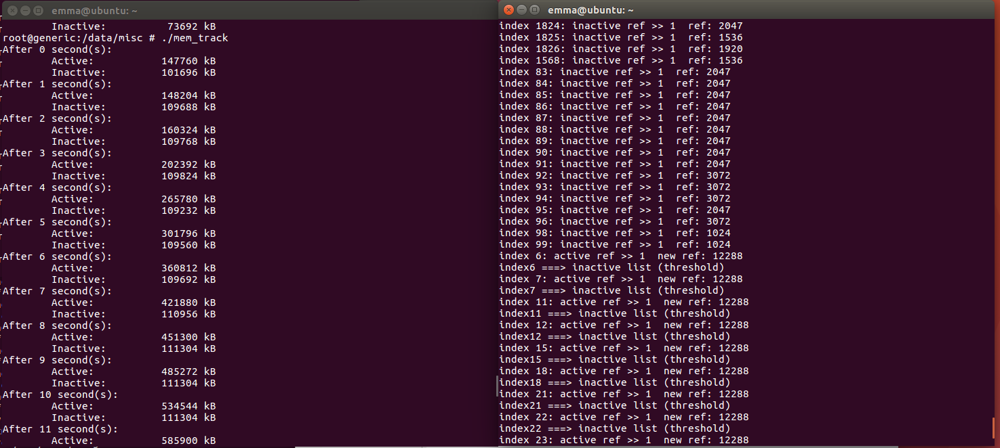

# CS356 Operating System Project 2: Android Memory Management

Objectives:   
* Compile the Android kernel. 
* Familiarize Android page replacement algorithm 
* Get the target process’s virtual address and physical address. 
* Implement a page replacement aging algorithm. 


Detailed description and guide can be found in CS356-Project2Guide.pdf


## 1. Problem 1: Compile the Kernel                                                                 

In this part, we change the configuration and complier the Linux kernel. The main steps are listed as follows.

- add the following path into environment variable.

  ```
  ANDROID_NDK_HOME/toolchains/arm-linux-androideabi-4.6/prebuilt/linux-x86_6
  4/bin
  ```

- Open **Makefile** in **KERNEL_SOURCE/goldfish/**, and find these: 

  ```c#
  ARCH   ?= $(SUBARCH) 
  CROSS_COMPILE ?=   
  ```

  Change it to:

  ```c#
  ARCH   ?= arm 
  CROSS_COMPILE ?=  arm-linux-androideabi- 
  ```

- Execute the following command in terminal to set compiling config: 

  ```
  make goldfish_armv7_defconfig 
  ```

- Modify compiling config: 

  ```c#
  sudo apt-get install ncurses-dev 
  make menuconfig 
  ```

  Open the **Compile the kernel with debug info** in **Kernel hacking** and **Enable** **loadable module support** with **Forced module loading**, **Module unloading** and **Forced module unloading** in it. 

- Finally, compile.

  ```
  make -j4
  ```

  The number of -j* depends on the number of cores of your system.  Here mine is 4.

  

## 2. Problem 2: Map a Target Process's Page Table                           

### 2.1 Description & Analysis                                                                                           

Create a system call, which after calling, will expose a specified process's page table in a read-only form, and will remain updated as the specified process executes. 

First, investigate the page table layout. We need to implement a system call to get the page table layout information of current system.  Since we use a 32-bit Android emulator, the page table only has two layers, so we only need use ` pgdir_shift` and ` page_shift`  to store `PGDIR_SHIFT` and `PAGE_SHIFT` of  current system.

Then, we need to implement the second call  to map a target process's Page Table into the current process's address space.   Since we can't modify other process's page table, we will do this by remapping page table entries in the kernel into a memory region mapped in user space. Thus, we need to build a fake pgd to translate a given virtual address to its physical address. 

In the second system call,  we first find the target process and investigate its all valid virtual addresses for the convenience of testing the system call later. A powerful kernel function ` page_range_walk() ` can recursively walk the page table and help us to remap all the page table to given physical address in user space, but , unfortunately, this function isn't exported to module programming.  We need to change it to export in kernel file **mm.h** and **pagetable.c**.  Then, another key is the function `usr_pmd_entry()` , which is invoked when entering second level of page table.  This function use `remap_pfn_range()` remap the page frame to user space and record the remapped page table address to `fake_pgd[pgd_index]`.

At last, we need to develop a program **VATranslate.c**  to test these two system call.


### 2.2 Source Code                                                                                                              

Here I just list some key code and omit functions like `addsyscall_init()` and `addsyscall_exit()`.

- system call **get_pagetable_layout**

  This system call is quite simple, just copy `PGDIR_SHIFT` and `PAGE_SHIFT` to struct `pgtbl_info`.

  ```c#
  struct pagetable_layout_info { 
       uint32_t pgdir_shift; 
       uint32_t page_shift; 
   }; 
   static int get_pagetable_layout(struct pagetable_layout_info __user * pgtbl_info, int size)
  {
      struct pagetable_layout_info pgt_layout;
      if (sizeof(struct pagetable_layout_info) > size)
  	{
  		printk(KERN_INFO "pgtbl_info size error!\n");
  		return -EINVAL;
  	}
      
      pgt_layout.pgdir_shift = PGDIR_SHIFT;  //the size of the area a second-level page table can map
  	pgt_layout.page_shift = PAGE_SHIFT;    //the page size
  	if(copy_to_user(pgtbl_info, &pgt_layout, size))
  	{
  		printk(KERN_INFO "copy to user space failed!\n");
  		return -EFAULT;
  	}
      return 0;
  }
  ```

  

- system call **expose_page_table**

  First, we use `find_get_pid()` and `get_pid_task()` to get the target process's `task_struct`. Then, we print the virtual memory areas the process uses. This will go into the `task_struct->mm` , so we have to  lock the semaphore which stored in `mm->mmap_sem` via `down_write()`. We also need to do this when we use `walk_page_range()` later.

  `walk_page_range()` isn't exposed, so we need to add **extern** before the definition of it in kernel file **mm.h** and add `EXPORT_SYMBOL(walk_page_range);` at the end of kernel file **pagetable.c**.

  `walk_page_range()` will recursively walk the page table for the memory area in a VMA with set of callbacks to invoke for each level of the tree.  The structure `mm_walk` is made up of these callbacks. Since we want to copy 2-level page table to user space, so we need to write our own **pmd_entry** function. 

  As for the structure `user_walk_info` ,  it's used to store pgd and pte information of our remapped page table in user space during walking. 

  ```c#
   struct user_walk_info{
       unsigned long *user_pgd;
       unsigned long user_pte_base;
   };
  
  static int expose_page_table(pid_t pid, unsigned long fake_pgd, unsigned long fake_pmds, unsigned long page_table_addr, unsigned long begin_vaddr, unsigned long end_vaddr)
  {
      if (begin_vaddr >= end_vaddr)
      {
          printk(KERN_INFO "invalid begin and end virtual address\n");
          return -EINVAL;
      }
    
      //find targer task struct
  	struct pid *my_pid = find_get_pid(pid);
      if(!my_pid)
      {
          printk(KERN_INFO "invalid pid\n");
          return -EINVAL;
      }
  	struct task_struct *target_task = get_pid_task(my_pid, PIDTYPE_PID);
      struct vm_area_struct *tmp;
      struct user_walk_info usr_walk;
  	struct mm_walk walk;
  
        // traverse and print the virtual memory areas
      down_write(&target_task->mm->mmap_sem); //lock
      printk(KERN_INFO "-------------Virtual memory area---------\n");
      for (tmp = target_task->mm->mmap; tmp; tmp = tmp->vm_next)
          printk(KERN_INFO "0x%08lx - 0x%08lx\n", tmp->vm_start, tmp->vm_end);
      up_write(&target_task->mm->mmap_sem);  //unlock
  
      //set up user_walk_info
      usr_walk.user_pgd = (unsigned long*)kmalloc(PGD_SIZE, GFP_KERNEL);
      if (!usr_walk.user_pgd)
      {
      	printk(KERN_INFO "user pgd fail to allcate!\n");
          return -EFAULT;
      }
      memset(usr_walk.user_pgd, 0, PGD_SIZE);
      usr_walk.user_pte_base = page_table_addr;
  
      //set up mm_walk
      walk.pgd_entry = NULL;
      walk.pud_entry = NULL;
      walk.pmd_entry = usr_pmd_entry;
      walk.pte_entry = NULL;
      walk.pte_hole = NULL;
      walk.hugetlb_entry = NULL;
      walk.mm  = target_task->mm;
      walk.private = (void*)(&usr_walk);
  
      //walk the page table from begin_vaddr to end_vaddr   
  	down_write(&target_task->mm->mmap_sem);//lock
      walk_page_range(begin_vaddr, end_vaddr, &walk);
  	up_write(&target_task->mm->mmap_sem);  //unlock
  
      // copy page directory to user space
      if (copy_to_user((void*)fake_pgd, usr_walk.user_pgd, PGD_SIZE))
      {
          printk(KERN_INFO "copy to user failed!");
          return -EFAULT;
      }
  
      kfree(usr_walk.user_pgd);
      return 0;
  }
  ```

  

  Function `usr_pmd_entry()` is our **pmd_entry** function, where we get the corresponding page frame of the pmd page and use `remap_pfn_range()` to remap the page table to user space. The original pgd_index of virtual address is the index of fake_pgd array to store pte entry.

  ```c#
  int usr_pmd_entry(pmd_t *pmd, unsigned long address, unsigned long next, struct mm_walk *walk)
  {
      if((!pmd) || (pmd_bad(*pmd)))
  	{
  		printk(KERN_INFO "invalid or bad pmd!\n");
  		return -EINVAL;
  	}
  
      // pgd_index of virtual address
      unsigned long index = pgd_index(address);
      struct user_walk_info *usr_walk = (struct user_walk_info*)walk->private;
  
      //convert pmd_page to it's page frame number
  	unsigned long pfn = page_to_pfn(pmd_page((unsigned long)*pmd));
  	if (!pfn_valid(pfn)){
  		printk(KERN_INFO "invalid pfn!\n");
  		return -EINVAL;
  	}
  
      //find virtual memory area for user page table base
      struct vm_area_struct *vma=find_vma(current->mm, usr_walk->user_pte_base);
  	if(!vma){
  		printk(KERN_INFO "can't find virtual memory address!\n");
  		return -EFAULT;
  	}
  
      //remap a page to user space 
  	if(remap_pfn_range(vma, usr_walk->user_pte_base, pfn, PAGE_SIZE, vma->vm_page_prot))
  	{
  		printk(KERN_INFO "fail to copy pte page to user sapce\n");
  		return -EFAULT;
  	}
  
      //use the index of va to trace the pa
  	usr_walk->user_pgd[index] = usr_walk->user_pte_base;
  	usr_walk->user_pte_base += PG_SIZE;
  	return 0;
  }
  ```

  

- **VATranslate.c**

  ​	The main function just deal with arguments, call the first system call, and print page table layout information. Besides, since we only translate one address, the end address equals to begin address plus one.

  ```c#
  int main(int argc, char **argv)
  {
      pid_t pid;
  	char *ptr;
  	unsigned long begin_vaddr, end_vaddr;
      struct pagetable_layout_info pg_layout;
  
      //check and handle arguments
      if (argc != 3)
      {
          printf("Wrong format!\n The correct format should be: ./VATranslate #PID #VA\n");
          return -1;
      }
      pid = atoi(argv[1]);
  	begin_vaddr = strtoul(argv[2], &ptr, 16);
  	end_vaddr = begin_vaddr + 1;
  
      
      //invoke system call to get pagetable layout
      if (syscall(__NR_layout, &pg_layout,sizeof(struct pagetable_layout_info)))
      {
          printf("fail to call syscall 356\n");
          return -1;
      }
  
      //print layout we get
      printf("------------Android pagetable layout-----------\n");
      printf("  pgdir_shift = %u\n", pg_layout.pgdir_shift);
      printf("  page_shift  = %u\n\n", pg_layout.page_shift);
  
      show_expose_pagetable(pid, begin_vaddr, end_vaddr, pg_layout);
      return 0;
  }
  ```

  

  Function `show_expose_pagetable()` test the second system call. First, allocate memory to `fake_pgd` and `page_table_addr` in user space. Then, call the system call. Finally, get the physical address according to virtual address and `fake_pgd`, and print it.

  ```c#
  void show_expose_pagetable(pid_t pid, unsigned long begin_vaddr, unsigned long end_vaddr,struct pagetable_layout_info pg_layout)
  {
      unsigned long fake_pgd, page_table_addr, pgd_index, pte_index, offset, phy_addr,pfn;
      unsigned long *pte;
  
      // allocate user-space memory
      fake_pgd = (unsigned long)malloc(2 * PAGE_SIZE);
      if (!fake_pgd)
      {
          printf("fail to allocate space to fake_pgd\n");
      	return;
      }
      page_table_addr = (unsigned long)mmap(NULL, 1 << 22, PROT_READ | PROT_WRITE, MAP_SHARED | MAP_ANONYMOUS, -1, 0);
      if (!page_table_addr)
      {
          printf("fail to allocate space to page_table_addr\n");
      	return;
      }
  
       // invoke system call expose_page_table()
  	if (syscall(__NR_expose, pid, fake_pgd, page_table_addr, begin_vaddr, end_vaddr))
      {
      	printf("Failed to call syscall expose pagetable layout()\n");
      	return;
      }
  
      // segment the virtual address
      pgd_index = (begin_vaddr >> pg_layout.pgdir_shift) & 0x7FF;
      pte_index = (begin_vaddr >> pg_layout.page_shift) & 0x1FF;
      offset = begin_vaddr & 0xFFF;
  
      // get physical address
      pte = (unsigned long*)((unsigned long*)fake_pgd)[pgd_index];
      if (pte)
      {
          pfn = pte[pte_index] & 0xFFFFF000;
          phy_addr = pfn + offset;
          if (pfn)
          {
              printf("-----------Virtual Address Translation------------\n");
              printf("  pgd_index: 0x%03lx\tpte_index: 0x%03lx\toffset: 0x%03lx\n", pgd_index, pte_index, offset);
              printf("pte_base=pgd_base[0x%03lx]=0x%08lx\npfn =pte_base[0x%03lx] =0x%08lx\n", pgd_index, (unsigned long)pte, pte_index, pfn);
              printf("  virtual address:0x%08lx ====> physical address: 0x%08lx\n\n", begin_vaddr, phy_addr);
          }
          else
              printf("The virtual memory is not in the memeory");
      }
      else
          printf("The virtual memory is not in the memeory");
      
      //free user-space memory
      free((void*)fake_pgd);
      munmap((void*)page_table_addr, 1 << 22);
      return;
  }
  ```

  

### 2.3 Result                                                                                                                          

I use **initial process** (with pid =1)  to test my program. First, I don't know the virtual memory of this process, so I pick up a address randomly. Unfortunately, the address isn't in it's virtual memory area.


But I can use command **dmesg** to check the information kernel print.



Then, I test some address on the list and the results are as follows.


## 3. Problem 3: Investigate Android Process Address Space                             

### 3.1 Description & Analysis                                                                                          

The program **vm_inspector.c** dumps the page table entries of a process in given range.  It's usage is `./vm_inspector pid begin_addresss end_address` and It's similar to **VATranslate.c**  in problem two. We just need to modify the value of argument `end_addr` and the part about printing. 

Use command **ps** to get the pid of current processes.

Try open an Android App in AVD and play with it. Then use **vm_inspector** to dump its page table entries for multiple times and see if there are some changes.

Use **vm_inspector** to dump the page tables of multiple processes, including Zygote. Refer to **/proc/pid/maps** in AVD to get the memory maps of a target process and use it  find the different and the common parts of page table dumps between Zygote and an Android app.

### 3.2 Source Code                                                                                                        

Just get and check arguments, allocate memory to `fake_pgd` and `page_table_addr`, call system call, the present pages' physical addresses, and finally print.

```c#
int main(int argc, char *argv[])
{
    unsigned long begin_vaddr, end_vaddr, current_vaddr, fake_pgd, page_table_addr;
    unsigned long pgd_index, pte_index, offset, pfn;
    unsigned long *pte;
    //check and get arguments
    if(argc != 4)
    {
        printf("Wrong arguments!\nCorrect usage:./vm_inspector  pid  begin_addresss end_address \n");
        return -1;
    }
	pid_t pid = atoi(argv[1]);
	begin_vaddr = strtoul(argv[2], NULL, 0);
    end_vaddr = strtoul(argv[3], NULL, 0);
    if(begin_addr>end_addr)
    {
        printf("end address must be larger than begin address!\n");
        return -1;
    }

     // allocate user-space memory
    fake_pgd = (unsigned long)malloc(2 * PAGE_SIZE);
    if (!fake_pgd)
    {
        printf("fail to allocate space to fake_pgd\n");
    	return -1;
    }
    page_table_addr = (unsigned long)mmap(NULL, 1 << 22, PROT_READ | PROT_WRITE, MAP_SHARED | MAP_ANONYMOUS, -1, 0);
    if (!page_table_addr)
    {
        printf("fail to allocate space to page_table_addr\n");
    	return -1;
    }

    // call syscall "expose_page_table"
    if(syscall(__NR_expose_syscall, pid, fake_pgd, page_table_addr, begin_vaddr, end_vaddr))
    {
        printf("Expose page table error!");
        return -1;
    }

    current_vaddr = begin_vaddr;
    ptrintf("\n-------virtual address translation-------\n");
    while(current_vaddr <= end_vaddr)
    {
        // segment the virtual address
        pgd_index = current_vaddr >> 21;
    	pte_index = (current_vaddr >> 12) & 0x1FF;
    	offset = current_vaddr & 0xFFF;
    	// get page frame number
    	pte = (unsigned long*)((unsigned long*)fake_pgd)[pgd_index];
    	pfn = pte[pte_index] & 0xFFFFF000;
    	//  only print pages that are present
		if (pfn)
             printf("  virtual address:0x%08lx  ====>  physical address: 0x%08lx\n", current_vaddr, pfn + offset);
    	current_vaddr += (1<<12);
    }

	// free allocated space
	free((void*)fake_pgd);
    munmap((void*)page_table_addr, 1 << 22);
	return 0;
}
```


### 3.3 Result                                                                                                                 

First, I use  **initial process** (with pid =1)  to test. I choose a range that some page are present while some are not. It turns out that only present page are translated.


Then, I use command **ps** to find the pid of current processes. Although pid may change from time to time,  pid of **Zygote** often lies in 80-90. The pid of APP usually is larger and inconstant.

I open some Android Apps and play with it. Then I use vm_inspector to dump its page table entries for multiple times. I found the some new pages in the later result. 

I test **Zygote** (pid = 83)and the **Phone**(pid =698). First, I use `/proc/pid/maps`  to get the memory maps of a target process. Then, I test some address area with the same name. The following one is **/system/bin/linker**. As we can see, some page share the same physical frame page while some not.


There also are some libraries that exactly have the same physical frame page. **/system/lib/libjpeg.so** is an example.


I also find some libraries that are shared across processes originate from Zygote with their pages all point to the same physical frames, such as **/system/lib/libjpeg.so**, **/system/lib/libpng.so**,  and **/system/lib/libmedia.so**.

Then, I search **Zygote** on the Internet and find that "Zygote is a special process in Android which handles the forking of each new application process". Zygote handles many repeated requests for the same physical resources. That's why we can find some identical physical addresses in both app’s pages and Zygote pages.

But there are some differences between  them. The physical address can be different even they share the same file name.  Besides, their permission to some files and position of stack are also different.


## 4. Problem 4: Change Linux Page Replacement Algorithm                        

### 4.1 Description & Analysis                                                                                          

In this part, you need to change the page replacement algorithm. You should add a new referenced variable to reflect the importance of a page. If a page is referenced by process, the referenced value of it should be shifted 1 bit to the right and added by $2^K$ which is defined by yourself. Otherwise, the referenced value shifts 1 bit to the right for every period. You should check these two lists periodically, move the page, whose reference value is greater than or equal to $2^K$ , to active list, and move the page, whose referenced value smaller than a threshold that defined by yourself, to inactive list. To accomplish this algorithm, `kswapd()` and `/proc/meminfo` will be helpful. 

The original algorithm use the second chance and LRU via variable `PG_active` and `PG_reference`. First, we need to remove the  original replacement algorithm and add our new variable `new_PG_ref`.  Function `kswapd()` will be called periodically. When there is a lack of memory, it will move pages between active list and inactive list and reclaim pages.  

During this process, page replacement algorithm mainly happens in function `make_page_accessed()` , `page_check_references()` and `shrink_active_list()`.  Function `make_page_accessed()` is called when a page is referenced by process. Here we choose $K=16$. Thus, `new_PG_ref` of the page is shifted 1 bit to the right and added by $2^{16}$ . As for the periodical check,  `page_check_references()` will be used to check pages in inactive list, so here we right shift `new_PG_ref` by 1 bit and check whether it's  greater than or equal to $2^{16}$ to decide whether move it to active list. Function `shrink_active_list()` will check active list, so we also right shift `new_PG_ref` of each page by 1 bit . And then we check whether it's smaller than the threshold, here  $2^{14}$ as example, to decide whether move it to inactive list.

Besides, we need to write a testing program which would occupy a lot of space to invoke function `kswapd()`.   Since`/proc/meminfo` shows too much information, I also write a program that only print the size of active and inactive list.


### 4.2 Source code                                                                                                                                    

- **Modification in mm_types.h**

  Add a new referenced variable in line 42.

  ```c#
  struct page {
  	//change 1: add a new referenced variable 
  	unsigned long new_PG_ref;
  	/* First double word block */
  	unsigned long flags;		/* Atomic flags, some possibly
  	......
  }
  ```

  

- **Modification in swap.c**

  `mark_page_accessed()` will be used every time we access a page. Thus, we need to remove previous code about variable `PG_referenced` , right shift new variable `new_PG_ref` by 1 bit and add  $2^{16}$ to it.  Those modification happens from line 369 to 379.

  ```c#
  void mark_page_accessed(struct page *page)
  {
  	//changes 2: add 2^k to new_PG_ref for page accessed
  	page->new_PG_ref = (page->new_PG_ref >> 1) + (1 << 16);
  	if (!PageActive(page) && !PageUnevictable(page) && PageLRU(page)) 
  		activate_page(page);
  	/*if (!PageActive(page) && !PageUnevictable(page) &&
  			PageReferenced(page) && PageLRU(page)) {
  		activate_page(page);
  		ClearPageReferenced(page);
  	} else if (!PageReferenced(page)) {
  		SetPageReferenced(page);
  	}*/
  }
  ```

  Besides, remove the code `ClearPageReferenced(page)` in line 478.

  ```c#
  	//change 3: remove operation about PG_referenced
  	//ClearPageReferenced(page);
  ```

  

- **Modification in vmscan.c**

  `page_check_references()` is called when we check page in inactive list. Thus, we add **change 4** to right shift `new_PG_ref` by 1 bit in line 754. It decides whether we reclaim, keep or activate a page in inactive list, so we add **change 5** to move page to active list if it has been referenced(pte>0) and it's `new_PG_ref` is greater than $2^{16}$ in line 792.  **Change 6** is about pages which need reclaiming and writing back, which lies on line 808.

  ```c#
  static enum page_references page_check_references(struct page *page,
  						  struct mem_cgroup_zone *mz, struct scan_control *sc)
  {
  	......
  	//change 4: shift right 1 bit
  	//referenced_page = TestClearPageReferenced(page);
  	referenced_page = page->new_PG_ref;
  	page->new_PG_ref = (page->new_PG_ref) >> 1;
  	printk("index %ld: inactive ref >> 1  ref: %ld\n",page->index, referenced_page);
  	......
  		//change 5: remove setRef and set active for ref>= 2^16
  		//SetPageReferenced(page);
  		if (referenced_page >= (1 << 16) || referenced_ptes > 1)
  		{
  			return PAGEREF_ACTIVATE;
  			printk(KERN_INFO "index %ld: ====> active!\n", page->index);
  		}
  	......
  	//change 6: if new_PG_ref >= (1<<16), try to
  	/* Reclaim if clean, defer dirty pages to writeback */
  	if (referenced_page >=(1<<16) && !PageSwapBacked(page))
          return PAGEREF_RECLAIM_CLEAN;
  ```

- `shrink_active_list()`  checks active list and removes pages from active list to inactive list.  Here, for each page in active list, we right shift variable `new_PG_ref ` by 1 bit and check whether `new_PG_ref` is greater than $2^{14}$ (threshold). If not, move the page to inactive list. These two changes happens in line 1794 and line 1814.

  ```c#
   static void shrink_active_list(unsigned long nr_to_scan,struct mem_cgroup_zone *mz,  struct scan_control *sc,int priority, int file)
      {	
          ......
      	while (!list_empty(&l_hold)) {
      		......
      		//change 7: right shift 1 bit for periodically checking active list
      		page->new_PG_ref = (page->new_PG_ref) >> 1; 
      		printk(KERN_INFO "index %ld: active ref >> 1  new ref: %ld\n",page->index, page->new_PG_ref); 
      		......
      		//change 8: move page to inactive list if new_PG_ref <= 2^14
      		if (page->new_PG_ref > (1<<14)){
      			list_add(&page->lru, &l_active);
      			continue;
      		}
      		ClearPageActive(page);	/* we are de-activating */
      		list_add(&page->lru, &l_inactive);
      		printk(KERN_INFO "index%ld ===> inactive list (threshold)\n", page->index);
      	}
    	.....
    }
  ```

  

- **testing program mem_occupy.c**

  The program is quite simple, just allocating memory to array. Given that it occupies 1GB memory theoretically, it will be killed soon. Before that, we can see `kswapd()` invoked and the changes of size of active and inactive list. Some key code is listed as follows.

  ```c#
      p = (unsigned long**)malloc(1 << 15);
      if (!p)
      {
      	printf("Memory allocation failed.\n");
          return -1;
      }
      {
          for (i = 0; i < (1 << 13); ++i)
          {
          	p[i] = (unsigned long*)malloc(1 << 17);
              if (!p[i])
              {
                  printf("Memory allocation failed.\n");
                  return -1;
              }
          	for (j = 0; j < 32; ++j)
          		p[i][j << 10] = j;
          }
          printf("Allocate done!\nReleasing after 1s.\n");
          sleep(1);
          for (i = 0; i < (1 << 13); ++i)
          	if(p[i])
          		free(p[i]);
      }
      if (p)
      	free(p);
  ```

  

- **mem_track.c** 

  Because `\proc\meminfo` shows too much information, I also write a program that only print the size of active and inactive list. Some key code is listed as follows. 

  ```c#
   	char mesg[256];
      int i,j;
      for (i = 0; i <= 50; i++)
      {
          printf("After %d second(s):\n", i);
          freopen("/proc/meminfo", "r", stdin);
      	for(j=0; j<6;j++)
      	fgets(mesg, 256, stdin);
      	printf("\t%s", mesg);
      	fgets(mesg, 256, stdin);
      	printf("\t%s", mesg);
          sleep(1);
      }
  ```


### 4.3 Result                                                                                                        

First, modify the kernel files and complier the kernel .

Then, run  program **mem_ocupy** and **mem_track** at the same time on AVD. Then, use **dmesg** to get the information printed by kernel. The following screen shots are captured when threshold is $2^{14}$ and $2^6$. I also test the original replacement algorithm and modified algorithm with threshold equals to $2^{12}$ and $2^{10}$. The results are recorded in file 6.txt, 10.txt, 12.txt, 14.txt, and origin.txt.




Based on the result we have, we can draw three graphs to see how active page list size, inactive page list size, and total page list size vary with time using different algorithm and threshold(D means threshold is $2^D$).   


From the figure, we can see the original Linux page replacement algorithm performs better. It's memory size of active/inactive/total page list change most quickly when lacking memory, which means it manages the page list most efficiently. In our algorithm, as threshold decreases, it becomes less efficient and takes more time for the page list size to change. 

Besides, we also can see our algorithm is less stable than the original algorithm. In original algorithm, the page list size almost don't change when test program is killed and it's size restore the original level.  But our algorithm has volatility even after it reaches the original level.

At last, during my test, I find that the status of AVD has a impact on the running time. Even I use the same threshold, the operation time may be quite different sometime. The original page list size is also different and can influent the outcome.

